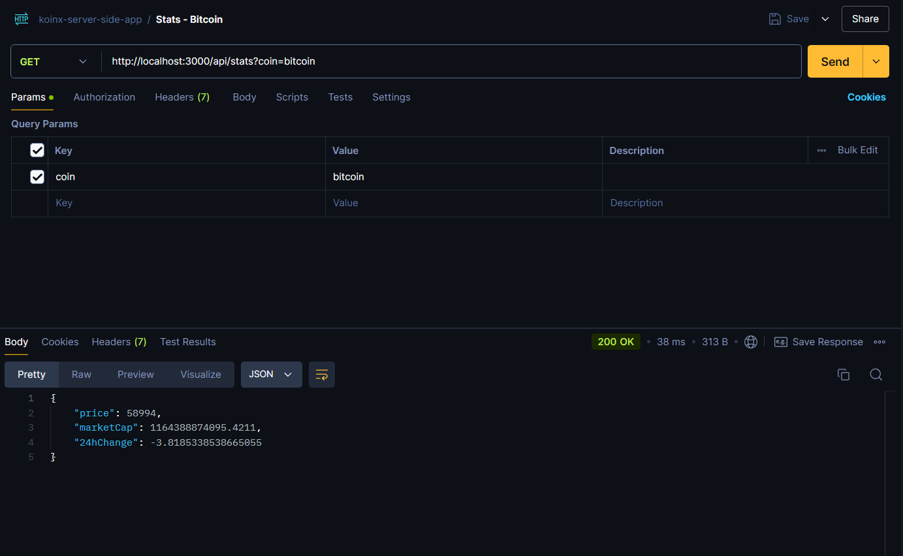
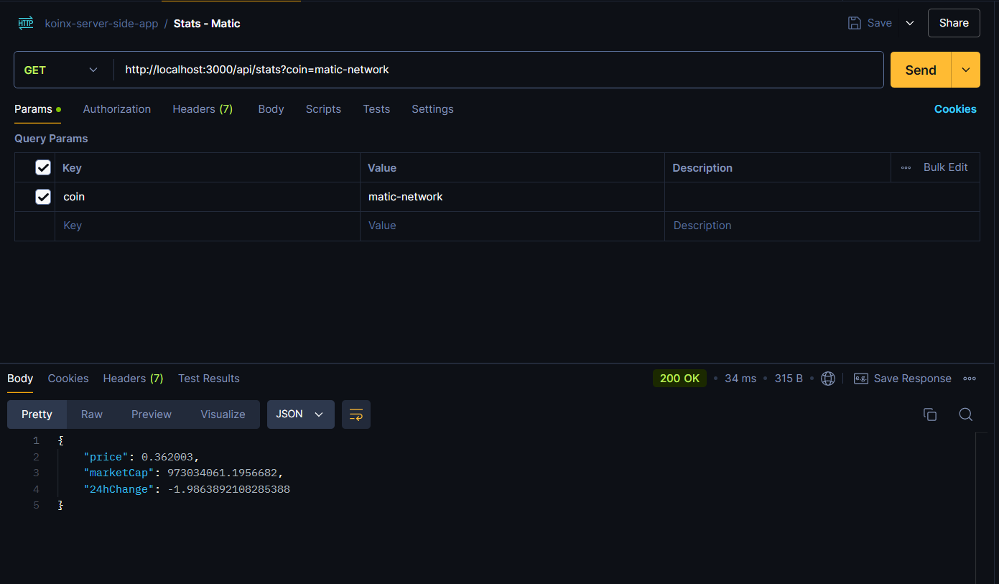
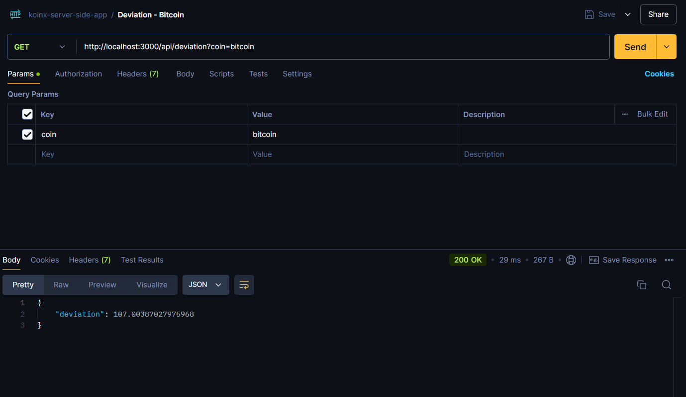
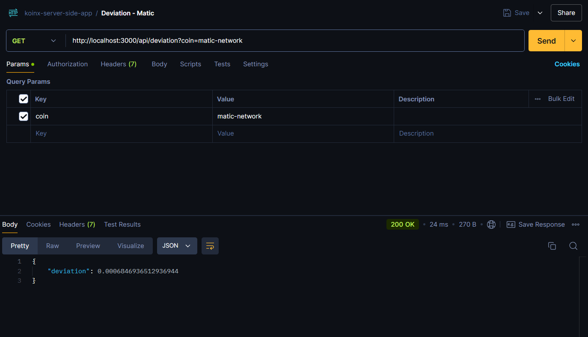
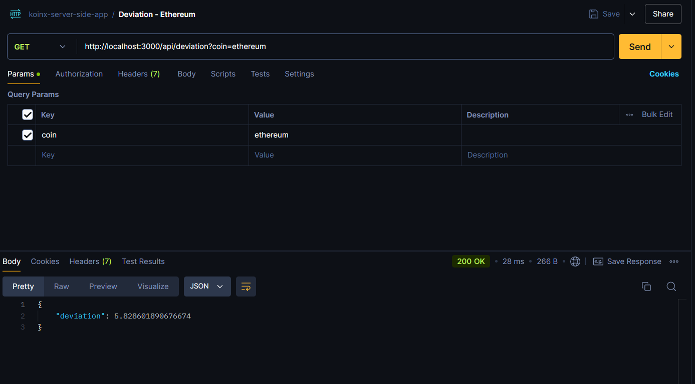

# KoinX Backend Internship Assignment

This project is a backend application developed using Node.js and MongoDB to track cryptocurrency prices for Bitcoin, Matic, and Ethereum. It fetches current market data every minute, stores it in a MongoDB database, and provides APIs for fetching the latest stats and calculating price deviation.

## Features

-   Fetches and stores the current price, market cap, and 24-hour change for Bitcoin, Matic, and Ethereum.
-   Provides an API endpoint to retrieve the latest data for a specific cryptocurrency.
-   Calculates and returns the standard deviation of the last 100 price records for a requested cryptocurrency.

## Technologies Used

-   **Node.js**: JavaScript runtime for building the server-side application.
-   **Express**: Web framework for building APIs.
-   **MongoDB**: NoSQL database for storing cryptocurrency data.
-   **Mongoose**: ODM library for MongoDB.
-   **Axios**: For making HTTP requests to the CoinGecko API.
-   **Node-cron**: For scheduling background jobs.
-   **dotenv**: For managing environment variables.

## Data Model

The data is stored in a MongoDB collection named `cryptos` with the following schema:

-   `coin`: String (required)
-   `price`: Number (required)
-   `marketCap`: Number (required)
-   `change24h`: Number (required)
-   `timestamp`: Date (default: current date)

## Deployment

Deployed on Vercel at following url: https://koinx-task-harsh.vercel.app

## API Endpoints

### 1. Get Latest Cryptocurrency Stats

-   **Endpoint**: `/api/stats`
-   **Method**: `GET`
-   **Examples**:

    -   `/api/stats?coin=bitcoin`
        

    -   `/api/stats?coin=matic-network`
        

    -   `/api/stats?coin=ethereum`
        

### 2. Get Price Deviation

-   **Endpoint**: `/api/deviation`
-   **Method**: `GET`
-   **Examples**:

    -   `/api/deviation?coin=bitcoin`
        

    -   `/api/deviation?coin=matic-network`
        

    -   `/api/deviation?coin=ethereum`
        

## Contributing

Contributions are welcome! Please feel free to submit a pull request or open an issue for any bugs or feature requests.
